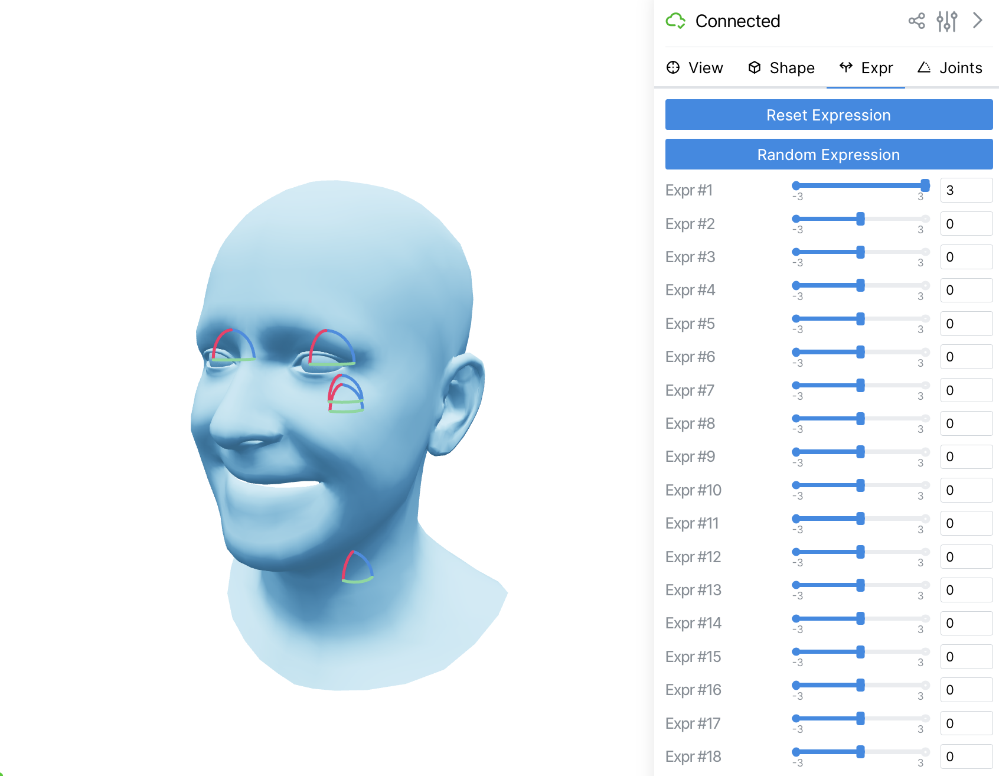

# tinyflame

A lightweight PyTorch implementation of the Faces Learned with an Articulated Model and Expressions parametric head model (FLAME) and real-time visualization interface.



## Description

Minimalistic FLAME implementation and easy-to-use interface that allows you to:
- Generate 3D face meshes with 300 shape parameters and 100+ expression parameters
- Control head pose, neck, jaw, and eye rotations
- Visualize and interact with the 3D face model in real-time using a [Viser](https://github.com/viser-ai/viser) web-based interface

The implementation is based on the [FLAME PyTorch code](https://github.com/soubhiksanyal/FLAME_PyTorch) and provides a clean, differentiable interface for head generation tasks.

## Installation

### 2.1 Requirements

- Python 3.12
- PyTorch
- NumPy
- Trimesh
- Viser (for visualization)
- Tyro (for command-line interface)

### 2.2. Download files

Visit the official [FLAME website](https://flame.is.tue.mpg.de): register or login, accept the license terms, and download the FLAME model `generic_flame2023.pkl` weights (or from the previous releases). Put the weights in the `data/` folder.

### 2.3. Environment Installation

Install the required dependencies using pip:

```bash
pip install -r requirements.txt
```

### 2.4 Check the Installation

Run the following command to check if the installation is successful:

```bash
bash check.sh --test
```

You should see the successfully passed test.

## Usage

### Interactive Visualization

Run the interactive 3D visualizer:

```bash
python run.py
```

This will start a web server (usually at `http://localhost:8080`) where you can:
- Adjust shape parameters in real-time
- Control facial expressions
- Manipulate head pose and joint angles
- Toggle wireframe mode and change colors
- Export the generated mesh

### Advanced Usage with Eyelid Control

If you want to control the eyelids, you can extend the run command with a new flag:

```bash
python run.py --control-eyelids
```

## Citation


```bibtex
@article{FLAME:SiggraphAsia2017,
  title = {Learning a model of facial shape and expression from {4D} scans},
  author = {Li, Tianye and Bolkart, Timo and Black, Michael. J. and Li, Hao and Romero, Javier},
  journal = {ACM Transactions on Graphics, (Proc. SIGGRAPH Asia)},
  volume = {36},
  number = {6},
  year = {2017},
  url = {https://doi.org/10.1145/3130800.3130813}
}
```

### License

This code is released under the MIT License. However, the model weights are subject to the license terms from the FLAME creators. Please refer to the [FLAME website](https://flame.is.tue.mpg.de) for the specific license terms and usage restrictions.